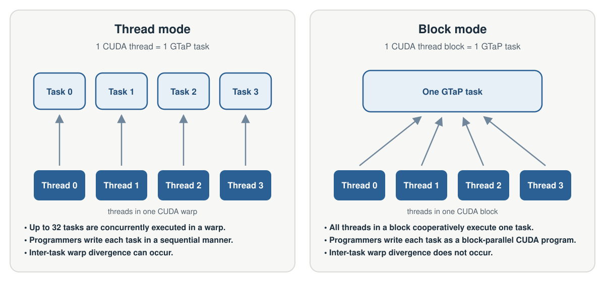

# Execution Modes

GTaP provides two execution modes. Both use the same fork-join pragmas, but
map one task to different CUDA execution units.

| Mode | One task runs on | Use when |
| --- | --- | --- |
| [Thread mode](#thread-mode) | One CUDA thread | The task body is fine-grained and mostly sequential |
| [Block mode](#block-mode) | One CUDA thread block | The task body uses shared memory, block synchronization, or cooperative parallel work |



Choose the mode based on the work performed inside one task. Start with thread
mode for sequential task bodies; use block mode when the threads of a CUDA
block need to cooperate within each task.

## Adaptive integration in both modes

The following two programs express the same adaptive numerical integration
algorithm. Each task estimates the integral over an interval. If the estimate
is not accurate enough, it spawns tasks for the left and right halves and joins
their results.

The helper `trap(a, b)` evaluates one trapezoid sequentially. In the block-mode
version, `block_trap(a, b, n)` distributes `n` trapezoids across the threads of
the block and broadcasts their sum.

### Thread-mode version

Each integration task runs sequentially on one CUDA thread. A CUDA warp can
therefore execute up to 32 integration tasks concurrently:

```cpp
#include "gtap_thread.cuh"

__device__ double d_result;

#pragma gtap function
__device__ double integrate(double a, double b) {
    double m = 0.5 * (a + b);
    double coarse = trap(a, b);
    double fine = trap(a, m) + trap(m, b);

    if (fabs(fine - coarse) < EPS)
        return (4.0 * fine - coarse) / 3.0;

    double left, right;

    #pragma gtap task
    left = integrate(a, m);

    #pragma gtap task
    right = integrate(m, b);

    #pragma gtap taskwait
    return left + right;
}

__global__ void exec_kernel(double lo, double hi) {
    #pragma gtap entry
    d_result = integrate(lo, hi);
}
```

### Block-mode version

Each integration task uses an entire CUDA thread block. The block cooperates
inside `block_trap`, while only thread 0 spawns the two child tasks:

```cpp
#define GTAP_BLOCK_SIZE 256
#include "gtap_block.cuh"

__device__ double d_result[GTAP_BLOCK_SIZE];

#pragma gtap function
__device__ double integrate(double a, double b) {
    constexpr int NTRAP = 256;
    double coarse = block_trap(a, b, NTRAP);
    double fine = block_trap(a, b, 2 * NTRAP);

    if (fabs(fine - coarse) < EPS)
        return (4.0 * fine - coarse) / 3.0;

    double m = 0.5 * (a + b);
    double left = 0.0, right = 0.0;

    if (threadIdx.x == 0) {
        #pragma gtap task
        left = integrate(a, m);

        #pragma gtap task
        right = integrate(m, b);
    }

    #pragma gtap taskwait
    return left + right;
}

__global__ void exec_kernel(double lo, double hi) {
    #pragma gtap entry
    d_result[threadIdx.x] = integrate(lo, hi);
}
```

The fork-join structure is the same, but its CUDA execution differs:

| Aspect | Thread mode | Block mode |
| --- | --- | --- |
| Work inside one task | `trap` runs sequentially | `block_trap` runs cooperatively across the block |
| Spawning one child | The task's thread executes `task` | The thread that reaches the `task` pragma—thread 0 in this example—spawns the child |
| Waiting | The task's thread reaches `taskwait` | Every thread in the block must reach `taskwait` |
| Child result in this example | Stored in `left` and `right` | Only thread 0 receives `left` and `right` |

## Thread mode

In thread mode, each GTaP task runs on one CUDA thread. Task functions can
therefore be written like ordinary sequential device code.

Include the thread-mode runtime:

```cpp
#include "gtap_thread.cuh"
```

Thread mode is a natural fit when:

- each task contains relatively fine-grained work
- the task body is mostly sequential
- the application creates many recursive or irregular tasks

### Divergence-aware queueing

Different thread-mode tasks may execute in the lanes of the same CUDA warp. If
those tasks follow different control-flow paths, warp divergence serializes
their paths and reduces utilization.

Divergence-aware queueing (DAQ) lets the program classify tasks by their
expected control flow. Configure more than one queue with `num_queues`, then
use `queue(expr)` when spawning a child:

```cpp
#pragma gtap task queue(child_kind)
result = visit(child);
```

The same clause on `taskwait` selects the queue used when the suspended
continuation becomes runnable:

```cpp
#pragma gtap taskwait queue(continuation_kind)
```

The expression must produce a queue index in `[0, num_queues)`. Queue
selection is a performance hint: program results and correctness must not
depend on the selected queue.

See the [Pragma Reference](../reference/pragmas) for the exact clause syntax
and the [Configuration Reference](../reference/configuration) for
`num_queues` and queue-capacity rules.

## Block mode

In block mode, each GTaP task runs cooperatively on all threads in one CUDA
thread block. A task body can use `threadIdx`, shared memory, block-wide
synchronization, and familiar CUDA data-parallel patterns.

Define the CUDA thread-block size before including the block-mode runtime:

```cpp
#define GTAP_BLOCK_SIZE 256
#include "gtap_block.cuh"
```

Block mode is useful when each task contains substantial data-parallel work,
such as shared-memory staging, cooperative graph processing, or parallel work
over a task-owned region.

### Why spawning is per-thread

In block mode, each thread that reaches `#pragma gtap task` spawns one child.
The directive is intentionally per-thread rather than collective so that
block-parallel work can generate multiple child tasks concurrently.

The block-mode asynchronous BFS example distributes a vertex's outgoing edges
across the block. Every thread that discovers an unvisited neighbor spawns a
separate task:

```cpp
#pragma gtap function
__device__ void bfs(int v) {
    int dv = g_depth[v];
    int row_start = g_row_offsets[v];
    int row_end = g_row_offsets[v + 1];

    for (int e = row_start + threadIdx.x;
         e < row_end;
         e += blockDim.x) {
        int u = g_col_indices[e];
        int old = atomicMin(&g_depth[u], dv + 1);

        if (old > dv + 1) {
            #pragma gtap task
            bfs(u);
        }
    }
}
```

One parent block can therefore spawn multiple BFS tasks in parallel. When a
program instead needs exactly one child, guard the spawn with a designated
thread, as in the integration example above.
