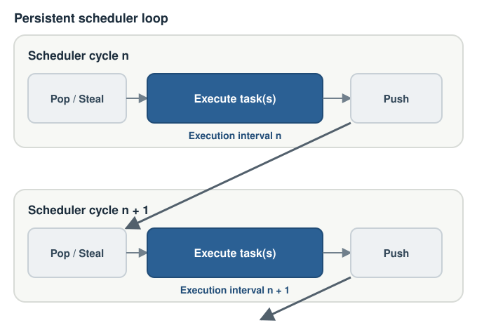

# Profiling

The optional GTaP profiler records task-execution intervals for each CUDA warp
in thread mode or CUDA thread block in block mode. Thread-mode intervals also
include the number of tasks executed in each batch.

::: info What is an execution interval?
GTaP runs a persistent scheduler on the GPU. In each scheduler cycle, it
obtains runnable tasks through pop or steal, executes them, and publishes newly
runnable tasks with push.



The profiler records the highlighted execution phase of each scheduler cycle
as one interval.

When a task function reaches `taskwait`, it returns to the scheduler and its
current interval ends. Once the wait condition is satisfied, the scheduler
invokes the function again, and the compiler-generated state machine resumes
execution after the `taskwait`. A single task can therefore produce multiple
execution intervals.

In thread mode, a warp can execute a batch of up to 32 tasks concurrently, so
one interval represents one batch and records its task count. In block mode, a
thread block executes one task cooperatively, so one interval represents one
task.

For further details on the scheduler design and implementation, see the
[GTaP paper](https://arxiv.org/abs/2604.05982).
:::

## Enable profiling

Compile a GTaP application with:

```text
-DGTAP_ENABLE_PROFILING
```

After launching and synchronizing the kernel, export the collected profile:

```cpp
gtap_profile_export_result result = gtap_export_profile({
    .output_directory = "./profile/fib_thread",
    .overwrite = true,
});
```

Without `GTAP_ENABLE_PROFILING`, the same function reports that profiling is
disabled.

## Profile capacity

Each worker has a fixed-capacity interval buffer:

- thread mode uses `config.profile_capacity_per_warp`
- block mode uses `config.profile_capacity_per_block`

Intervals that do not fit are omitted and reported in
`result.dropped_intervals`. Increasing the capacity also increases profiling
memory usage.

## Visualize a profile

The Fibonacci example includes a small Python script that demonstrates one way
to turn the exported data into figures. After generating a thread-mode profile:

```bash
cd examples/fib
python3 visualize_profile.py
```

For example, the thread-mode Fibonacci profile produces a timeline like this:


Profiling changes runtime behavior and should be treated as an analysis mode,
not as the source of final performance numbers.

For all export options, result fields, and status values, see the
[Profiling API Reference](../reference/profiling).
